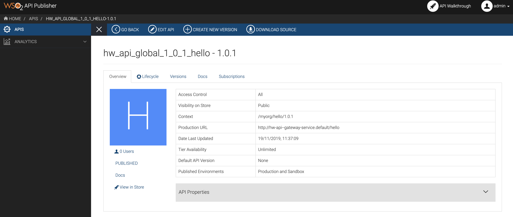

# Api Versioning - Hello-world-api cell

Hello-world-api cell defines a standard contract for the external parties to communicate with it. Hence, it is
accessible only via the cell gateway. Let's see how to manage api versions in Cellery by using hello-world-api sample.

## Exposing Apis for External Access

Cell APIs can be selectively published to the Cellery global gateway to be accessed by external clients. This is done by 
marking the relevant HTTP ingress as `expose: global`. APIs which are only need to expose via local cell gateway, can
mark the relevant HTTP ingress as `expose: local`.

Context field under ingress is used to expose a set of cell APIs globally with a unique context. Also each set of APIs
can have their own API versions and those versions can be specified by using the apiVersion field. The default API
version(0.1) will applied if no version is specified under apiVersion.

ingress of our globally exposed hello-world-api cell will looks like the below.
```ballerina
ingress: <cellery:HttpApiIngress>{
    port: 9090,
    context: "/hello",
    definition: {
        resources: [
            {
                path: "/",
                method: "GET"
            }
        ]
    },
    expose: "global",
    apiVersion: "1.0.0"
}
```

In the above ingress, the API will he published with the context `/<cell-name>/hello/1.0.0`.
 
Hello-world-api can be exposed with a common root context by using the global publisher configuration.  
Each context specified in the HTTP ingress will be used as a sub context of the root context specified in the publisher.

Note: When there are multiple APIs available, the version specified in here will apply to all the APIs. Any API version
specified under apiVersion in ingress is overwritten by globalPublisher apiVersion.
Ex.:
```ballerina
ingress: <cellery:HttpApiIngress>{
    port: 9090,
    context: "/hello",
    definition: {
        resources: [
            {
                path: "/",
                method: "GET"
            }
        ]
    },
    expose: "global",
    apiVersion: "1.0.0"
};

cellery:CellImage helloCell = {
    globalPublisher: {
        apiVersion: "1.0.1",
        context: "myorg"
    },
    // ...
};
```
Here the the global API will be published as `/myorg/hello/1.0.1`. Note that the root context `/myorg` is picked from the
globalPublisher section and the sub context hello is picked from the http ingress.

## Global API URL

Globally exposed API url can be found by executing `cellery list ingresses <instance-name>`.

```aidl
  CONTEXT   INGRESS TYPE   VERSION   METHOD   RESOURCE        LOCAL CELL GATEWAY                       GLOBAL API URL
 --------- -------------- --------- -------- ---------- ------------------------------- ---------------------------------------------
  /hello    http           0.1       GET      /          hw-api--gateway-service/hello   https://wso2-apim-gateway/myorg/hello/1.0.1
```

Also the context of the published API can be found by login to [api-publisher](https://wso2-apim/publisher/) as admin user.
(username: admin, password: admin)



Note: Published API will have a name according to `<cell-name>_global_<global-version>_<api-context>`.

## What's Next?
- [Pet store sample](../../cells/pet-store/README.md) - provides the instructions to work with pet-store sample.
